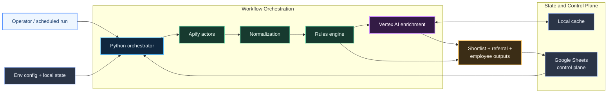

# AI Job Search MVP

Cloud-oriented career intelligence pipeline for sourcing, scoring, ranking, and operationalizing job opportunities.

This repository packages a practical workflow that combines external job discovery, rules-based scoring, LLM enrichment on Vertex AI, Google Sheets as an operational control plane, and optional employee/referral targeting. The implementation is intentionally MVP-shaped, but the architecture maps well to Solution Architect, cloud operations, and workflow automation conversations.

## What This Repo Demonstrates

- multi-service workflow orchestration in Python
- API integration across Apify, Vertex AI, and Google Sheets
- rules engine plus LLM hybrid scoring
- operational state management for throttled third-party workloads
- spreadsheet-driven human-in-the-loop workflow design
- credential isolation through env-based configuration
- cloud workflow framing suitable for GCP and extensible to broader platform architecture

## High-Level Architecture

1. Discovery layer runs Apify actors for Google-based job search and optional LinkedIn collection.
2. Normalization layer maps heterogeneous raw records into a unified job schema.
3. Scoring layer applies deterministic heuristics for fit, risk, mobility, and strategic value.
4. LLM layer uses Vertex AI to enrich top candidates with fit, visa, and resume-tailoring analysis.
5. Decision layer produces a shortlist plus referral and employee-target outputs.
6. Persistence layer writes back to Google Sheets while preserving manual recruiter-style workflow fields.



See [docs/architecture.md](docs/architecture.md) for a deeper system view and [docs/operating-model.md](docs/operating-model.md) for operational behavior.

## Core Use Case

The workflow is designed for high-signal job search triage in cloud, AI, and solution-oriented roles such as:

- Solutions Architect
- Customer Engineer
- Forward Deployed Engineer
- Solutions Engineer
- Technical GTM / platform-facing roles

Instead of manually reviewing fragmented job sources every day, the pipeline consolidates sourcing, ranking, prioritization, and outreach prep into one repeatable process.

## Current Workflow

1. Seed `Target_Companies` on first run and load active companies from Google Sheets.
2. Run Google Search Results Scraper for broad ATS discovery.
3. Run targeted Google search queries for priority companies.
4. Optionally run LinkedIn Jobs Scraper on a throttled cadence.
5. Normalize, deduplicate, and score all discovered roles.
6. Select a shortlist candidate pool and enrich top jobs through Vertex AI.
7. Generate `Daily_Shortlist`, `Referral_Targets`, and optional `Employee_Targets`.
8. Write outputs to Google Sheets while preserving manual workflow columns.

## Repo Structure

- `main.py` — orchestration entrypoint and run-state management
- `config.py` — environment parsing, defaults, and config validation
- `apify_workflow_client.py` — actor execution, polling, and dataset retrieval
- `normalizer.py` — raw source item normalization
- `scoring.py` — deterministic scoring and prioritization heuristics
- `llm_analyzer.py` — Vertex AI enrichment and local cache handling
- `referral_targets.py` — shortlist generation and referral targeting
- `employee_targets.py` — employee filtering and outreach-draft preparation
- `message_generator.py` — draft connection note generation
- `sheets.py` — Google Sheets control plane integration
- `docs/` — architecture and operating-model documentation

## Setup

```bash
python3 -m venv .venv
source .venv/bin/activate
pip install -r requirements.txt
cp .env.example .env
```

Populate `.env` with your own values.

Required:

- `APIFY_TOKEN`
- `LINKEDIN_JOBS_ACTOR_ID`
- `GOOGLE_SEARCH_ACTOR_ID`
- `LINKEDIN_EMPLOYEES_ACTOR_ID`
- `GOOGLE_SHEET_NAME`
- `GOOGLE_SERVICE_ACCOUNT_FILE` or `GOOGLE_SERVICE_ACCOUNT_JSON`

Optional but important:

- `GOOGLE_SHEET_URL`
- `GOOGLE_CLOUD_PROJECT`
- `VERTEX_AI_LOCATION`
- `GEMINI_MODEL`
- `ENABLE_GEMINI`
- `RUN_LINKEDIN_JOBS_EVERY_N_RUNS`
- `ENABLE_LINKEDIN_EMPLOYEE_DISCOVERY`

If your Google Sheet already exists, share it with the service-account email as `Editor`.

## Running Locally

```bash
python main.py
```

The workflow logs:

- run count and LinkedIn throttle decision
- active target companies
- actor execution and item counts
- LLM call/caching behavior
- row writes per output tab
- end-of-run summary

## Output Tabs

The workflow maintains:

- `Jobs_Raw`
- `Jobs_Scored`
- `Daily_Shortlist`
- `Referral_Targets`
- `Employee_Targets`
- `Outreach_Tracker`
- `Resume_Tailoring`
- `Target_Companies`

Google Sheets acts as a lightweight operational UI, not just a dump target. The pipeline preserves manual decision fields across reruns so human workflow state is not lost.

## Cloud and Architecture Positioning

This repo is still an MVP, but it maps to several architecture and platform skills:

- event-style orchestration and stepwise workflow design
- service boundary management across SaaS and cloud APIs
- ranking logic that combines deterministic and probabilistic signals
- cost-aware throttling and selective enrichment
- human-in-the-loop operational systems
- integration patterns that could be migrated from local execution into schedulers, containers, or serverless jobs

## Security and Credentials

- real service-account JSON files are intentionally excluded from git
- `.env` is ignored
- local cache and state files are ignored
- the repo is designed to run from externally supplied credentials, not embedded secrets

See [SECURITY.md](SECURITY.md).

## Suggested Runtime Evolution

This repo currently runs as a local orchestrated workflow. A more production-like evolution would be:

- containerize the pipeline and run on Cloud Run jobs or ECS scheduled tasks
- replace local state files with cloud-managed state storage
- move operational logs into Cloud Logging / CloudWatch equivalents
- push results to a database or warehouse alongside Sheets
- separate enrichment and discovery into independently schedulable tasks

## Branch Note

This working branch uses Vertex AI SDK integration rather than direct Gemini REST API usage. The branch exists to show the more cloud-native and enterprise-aligned path.
