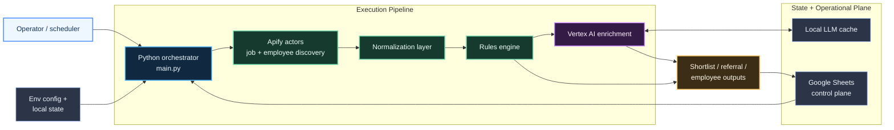

# Architecture

## Purpose

The system is a decision-support workflow for job search operations, not just a scraper. It combines discovery, normalization, scoring, enrichment, and spreadsheet-driven task management.

## Architecture Diagram

## Service Components

- Apify actors for search execution and external data retrieval
- Python orchestration layer for workflow sequencing
- rules engine for deterministic prioritization
- Vertex AI for semantic enrichment and resume guidance
- Google Sheets as the operational control plane and output workspace

## Data Flow

1. Read config and initialize runtime dependencies.
2. Seed or load `Target_Companies`.
3. Execute Google and optional LinkedIn discovery.
4. Normalize all discovered jobs into a unified internal schema.
5. Deduplicate and score jobs with rule-based heuristics.
6. Select top candidate pool for LLM enrichment.
7. Enrich selected jobs with Vertex AI.
8. Build shortlist, referral targets, and employee targets.
9. Persist outputs to Google Sheets while preserving manual workflow fields.

## Design Choices

- Google Sheets is used as an operator-facing control plane because it supports rapid iteration and manual overrides.
- LLM enrichment is selectively applied to control cost and reduce unnecessary calls.
- Local cache and run-state files keep the MVP simple while still allowing throttling and repeatability.
- Deterministic scoring remains in place even when LLM enrichment is disabled.

## Evolution Path

The current design can evolve into a more production-style architecture by:

- replacing local state with cloud storage or a database
- splitting discovery and enrichment into separate scheduled jobs
- moving execution into Cloud Run jobs, ECS scheduled tasks, or an Airflow-like orchestrator
- instrumenting cost, latency, and quality metrics centrally
